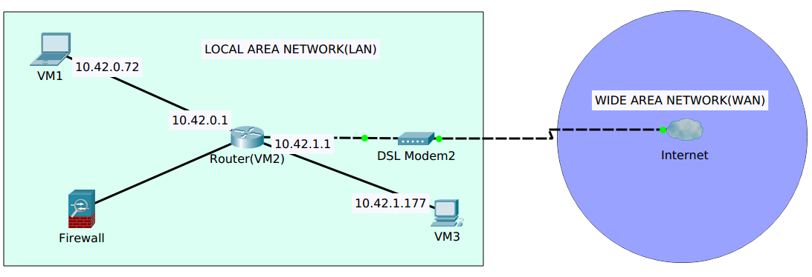

# METIN (Message Encapsulation over TCP/IP Network)
## Purpose of Project
Project name is METIN (Message Encapsulation over TCP/IP Networks). This project aims to create a system that communicates over HTTP and at the mean time encapsulate a hidden TCP/IP protocol in the HTTP traffic without being detected by firewalls. Although network traffic is blocked by the firewall, the SSH connection can be established with bypassing firewall.
## Used Technology
- Socket Programming in C
- Libssh Library in C
- VirtualBox for Simulation Environment
- Cisco Packet Tracer
- Iptables Firewall
- AES256 Cryptology
## Simulation Environment
- UBUNTU 16.04.5 LTS was used by Virtual Machines in this simulation.
- Uncomment block "#net.ipv4.ip_forward=1" in sysctl.conf for acting VM2 as router. 

## How to Use
- You must install “libssh” library before you start configuration. You can follow the installation here. (www.libssh.org/get-it/)
- You need port forwarding because your computer as a server for other devices.
- The 80 port of the modem must be switched on.
- You must download the METIN source code from GitHub.(https://github.com/MertPehlivancik/METIN-Message-Encapsulation-over-TCP-IP-Network-/)
- After downloading the source code, you compile and run the "SERVER" file on the external network. 
- The server started listening to HTTP Requests.
- If the server settings are done, configure the computer settings on the internal network.
- You compile and run the “CLIENT” file on the internal network client.
- When running the client, it will need the server’s IP address and port.
- After connection was established, you can send command to SSH Server despite firewall blocking.
- deneme (https://github.com/MertPehlivancik/METIN-Message-Encapsulation-over-TCP-IP-Network-/archive/master.zip)

